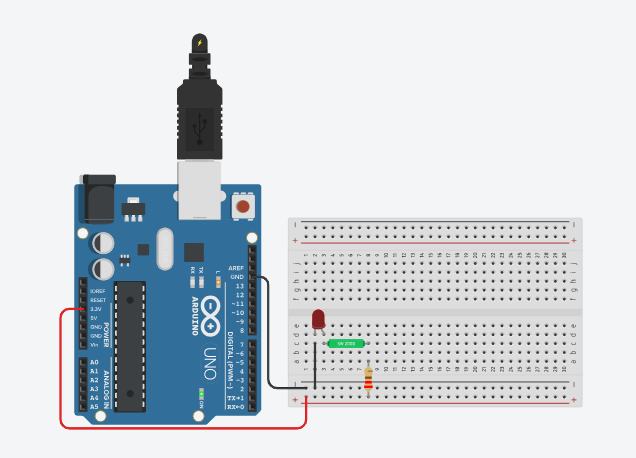

# Usando um sensor de inclinação
 Neste experimento um sensor de inclinação SW200D será utilizado para acender um LED.  

 <b><a href="https://www.tinkercad.com/things/gGm8KDnpM9f">Clique Aqui</a></b> para ver o projeto em Tinkercard.com!
 
## Lista de componentes:

- 1  Arduíno UNO R3
- 1  Um cabo de conexão USB
- 1  Placa de prototipação (Protoboard)
- 1  SW 200D
- 1  Resistor de 220 Ω ohms
- 3 Jumpers (macho-macho)

## Esquema do projeto

